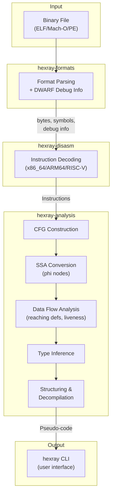

# Architecture Overview

hexray is organized as a Cargo workspace with multiple crates, each handling a specific responsibility.

## Crate Dependency Graph

```
hexray (CLI)
    ├── hexray-analysis
    │   └── hexray-core
    ├── hexray-formats
    │   └── hexray-core
    ├── hexray-disasm
    │   └── hexray-core
    ├── hexray-demangle
    ├── hexray-signatures
    │   └── hexray-core
    ├── hexray-types
    └── hexray-emulate
        └── hexray-core
```

## Crates

### hexray-core

Core abstractions shared across all crates.

**Key Types:**
- `Instruction` - Architecture-agnostic instruction representation
- `Operand` - Instruction operands (registers, immediates, memory)
- `Operation` - Semantic operation type (Add, Sub, Move, Call, etc.)
- `BasicBlock` - A sequence of instructions with single entry/exit
- `ControlFlowGraph` - Graph of basic blocks with edges
- `Symbol` - Binary symbol with name, address, type

```rust
pub struct Instruction {
    pub address: u64,
    pub size: usize,
    pub bytes: Vec<u8>,
    pub mnemonic: String,
    pub operands: Vec<Operand>,
    pub operation: Operation,
    pub control_flow: ControlFlow,
}
```

### hexray-formats

Binary format parsers (ELF, Mach-O, PE) and debug info.

**Key Traits:**
```rust
pub trait BinaryFormat {
    fn architecture(&self) -> Architecture;
    fn entry_point(&self) -> Option<u64>;
    fn symbols(&self) -> Box<dyn Iterator<Item = &Symbol>>;
    fn sections(&self) -> Box<dyn Iterator<Item = &dyn Section>>;
    fn bytes_at(&self, addr: u64, len: usize) -> Option<&[u8]>;
}
```

**Supported Formats:**
- ELF (32/64-bit, little/big endian)
- Mach-O (32/64-bit, universal/fat binaries)
- PE (Windows PE32/PE32+, executables and DLLs)

**DWARF Debug Info (`dwarf` module):**
- `DebugInfo` - High-level interface for debug information
- `CompilationUnit` - Parsed compilation unit with DIEs
- `LineNumberProgram` - Source location mapping
- `FunctionInfo` - Function with parameters and local variables

### hexray-disasm

Architecture-specific instruction decoders.

**Key Trait:**
```rust
pub trait Disassembler {
    fn decode(&self, bytes: &[u8], address: u64) -> Result<Instruction, DecodeError>;
    fn min_instruction_size(&self) -> usize;
    fn max_instruction_size(&self) -> usize;
}
```

**Supported Architectures:**
- x86_64 (variable length, 1-15 bytes)
  - Full VEX prefix support (SSE, AVX, AVX2)
  - EVEX prefix support (AVX-512)
  - BMI1/BMI2 bit manipulation
- ARM64 (fixed 32-bit instructions)
  - NEON SIMD instructions
  - SVE/SVE2 scalable vectors
  - Atomics (LDXR, STXR, CAS, LDADD)
- RISC-V (32-bit base, 16-bit compressed)
  - RV32I/RV64I base
  - M extension (multiply/divide)
  - A extension (atomics)
  - C extension (compressed)

### hexray-analysis

Analysis passes and decompilation.

**Components:**
- `CfgBuilder` - Constructs CFG from linear instruction stream
- `FunctionFinder` - Identifies function boundaries
- `Decompiler` - Transforms CFG to pseudo-code
- `Structurer` - Recovers high-level control flow (if/else, loops, switch)

**Data Flow Analysis (`dataflow` module):**
- `Location` - Represents registers, stack slots, memory locations
- `ReachingDefinitions` - Forward analysis: which defs reach each point
- `LivenessAnalysis` - Backward analysis: which values are live
- `DefUseChain` - Links definitions to their uses
- `DataFlowQueryEngine` - Interactive queries (trace backward/forward)
- `ConstantPropagation` - Constant value tracking

**SSA Form (`ssa` module):**
- `SsaBuilder` - Converts CFG to SSA form
- `SsaValue` - Versioned value (e.g., `rax_1`, `rax_2`)
- `PhiNode` - Merges values at control flow join points
- `SsaFunction` - SSA representation of a function
- SSA optimizations: dead code elimination, copy propagation, constant folding

**Type Inference (`types` module):**
- `Type` - Type representation (int, pointer, struct, etc.)
- `TypeInference` - Constraint-based type recovery engine
- `FunctionSignatures` - Known function prototypes

**Cross-References (`xrefs` module):**
- `XrefDatabase` - Code and data cross-references
- `XrefBuilder` - Builds xref database from instructions

**String Detection (`strings` module):**
- `StringDetector` - Finds ASCII/UTF-8/UTF-16 strings
- `DetectedStringTable` - String address → content mapping

**Decompilation Pipeline:**
```
Instructions → CFG → SSA → Data Flow → Type Inference → Structured CFG → Expressions → Pseudo-code
```

### hexray-demangle

Symbol name demangling.

**Supported Schemes:**
- Itanium C++ ABI (GCC, Clang)
- Rust v0 mangling scheme

### hexray-signatures

Function signature recognition (FLIRT-like).

**Key Types:**
- `BytePattern` - Pattern with wildcards for matching
- `FunctionSignature` - Signature with name, pattern, metadata
- `SignatureDatabase` - Collection of signatures with fast lookup
- `SignatureMatcher` - Matches functions against database

**Builtin Signatures:**
- libc functions (x86_64, AArch64)
- Common library patterns

### hexray-types

C type libraries for decompiler integration.

**Key Types:**
- `CType` - C type representation (int, pointer, struct, etc.)
- `StructType` - Struct with fields and layout
- `FunctionPrototype` - Function signature
- `TypeDatabase` - Collection of types

**Builtin Types:**
- POSIX types (size_t, pid_t, etc.)
- Linux-specific (struct stat, etc.)
- macOS-specific (mach_port_t, etc.)
- libc functions

### hexray-emulate

Static emulation for indirect call/jump resolution.

**Key Types:**
- `Value` - Concrete, Symbolic, or Unknown
- `MachineState` - Registers, memory, flags
- `Emulator` - Instruction interpreter
- `ExecutionResult` - Final state and resolved targets

**Capabilities:**
- Concrete execution of x86_64 instructions
- Jump table resolution
- Indirect call resolution
- Loop detection

## Data Flow



## Adding a New Architecture

1. Create a new module in `hexray-disasm/src/`
2. Implement the `Disassembler` trait
3. Add architecture detection in `hexray-formats`
4. Register in the CLI dispatcher

Example decoder structure:
```rust
pub struct MyArchDisassembler;

impl Disassembler for MyArchDisassembler {
    fn decode(&self, bytes: &[u8], address: u64) -> Result<Instruction, DecodeError> {
        // Decode bytes into Instruction
    }

    fn min_instruction_size(&self) -> usize { 2 }
    fn max_instruction_size(&self) -> usize { 4 }
}
```

## Adding a New Binary Format

1. Create a new module in `hexray-formats/src/`
2. Implement the `BinaryFormat` trait
3. Add format detection in `detect_format()`
4. Export from `lib.rs`
