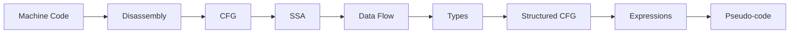
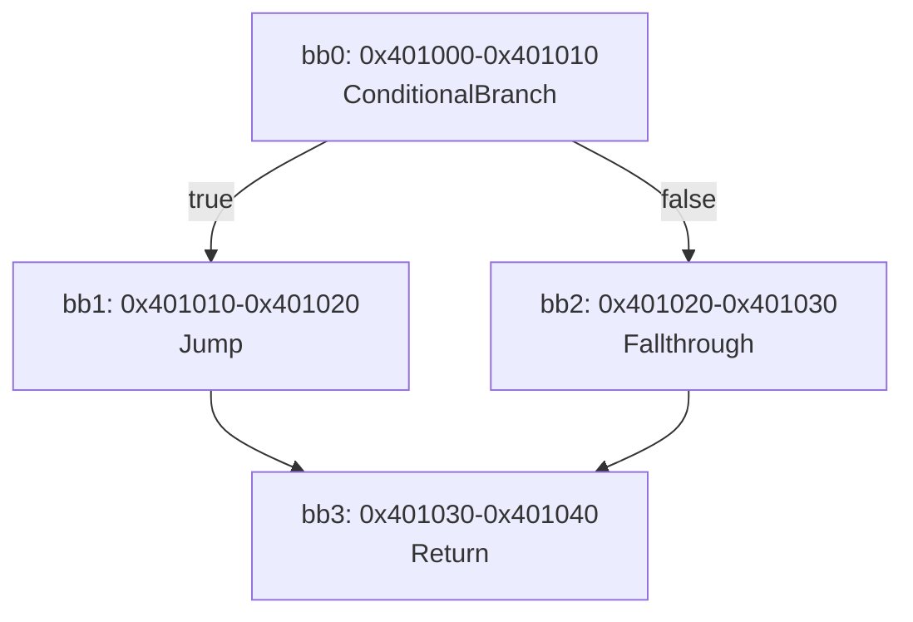
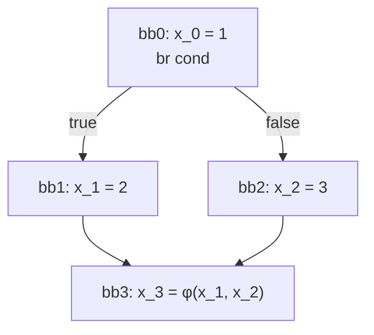
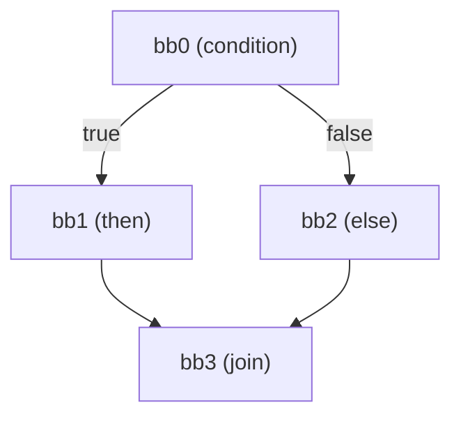
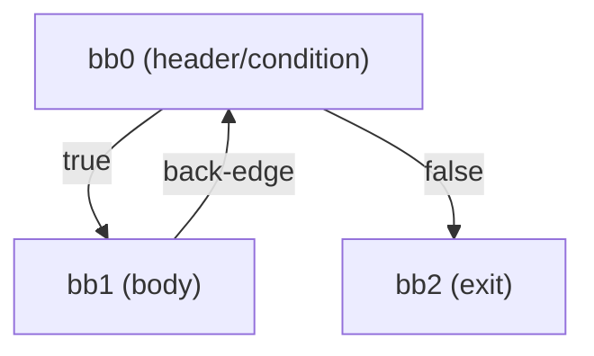

# Decompiler Guide

The hexray decompiler transforms machine code into readable pseudo-code through several stages.

## Pipeline Overview



### Stage 1: Disassembly

Machine code bytes are decoded into architecture-agnostic `Instruction` objects:

```rust
Instruction {
    address: 0x401000,
    mnemonic: "mov",
    operation: Operation::Move,
    operands: [Register(RAX), Immediate(42)],
    control_flow: ControlFlow::Sequential,
}
```

### Stage 2: CFG Construction

Instructions are grouped into basic blocks based on control flow:

- **Basic Block**: Sequence of instructions with single entry, single exit
- **Edges**: Represent possible control flow between blocks
- **Terminators**: Branch, ConditionalBranch, Return, etc.



### Stage 3: SSA Conversion

The CFG is converted to Static Single Assignment (SSA) form, where each variable is assigned exactly once. This simplifies subsequent analysis.

**Phi Node Placement:**
At control flow join points, phi nodes merge values from different paths:



**Version Numbering:**
Each definition creates a new version of a variable:
```
rax_0 = 1      // First definition
rax_1 = rax_0 + 5  // Second definition uses rax_0
```

### Stage 4: Data Flow Analysis

Multiple dataflow analyses provide information for optimization and type recovery:

**Reaching Definitions (Forward):**
Computes which definitions may reach each program point.

```rust
// At instruction `rax = rbx + rcx`:
// Reaching defs for rbx: {bb0:inst2}
// Reaching defs for rcx: {bb1:inst0, bb2:inst1}
```

**Liveness Analysis (Backward):**
Computes which values are live (may be used before redefined).

```rust
// rax = rbx  ; rbx is live before, rax is live after (if used later)
// ... rax used here ...
// rax = 5    ; rax is dead after (if not used)
```

**Def-Use Chains:**
Links each definition to all its uses, enabling:
- Dead code elimination (defs with no uses)
- Constant propagation
- Copy propagation

**Data Flow Queries:**
Interactive queries for tracing values:
- `TraceBackward`: Where does this value come from?
- `TraceForward`: Where does this value go?
- `FindUses`: All uses of a definition
- `FindDefs`: All definitions reaching a use

### Stage 5: Type Inference

Constraint-based type recovery infers types from instruction semantics:

**Type Constraints:**
```rust
// mov [rbp-8], 10   → rbp-8 is pointer to int32
// add rax, 5        → rax is integer
// mov rax, [rbx]    → rbx is pointer, rax gets pointed-to type
// lea rax, [rbp-8]  → rax is pointer to type at rbp-8
```

**Inferred Types:**
```rust
Type::Int { size: 4, signed: true }        // int32
Type::Int { size: 8, signed: false }       // uint64
Type::Pointer(Box::new(Type::Int { .. }))  // int*
Type::Struct { fields: [(0, int32), (4, int32)], size: 8 }
```

### Stage 6: Control Flow Structuring

The CFG is analyzed to recover high-level constructs:

**If-Then-Else Detection:**



→ `if (cond) { bb1 } else { bb2 }`

**While Loop Detection:**



→ `while (cond) { bb1 }`

**Switch Statement Detection:**
Jump tables are analyzed to recover switch statements with case labels.

**Short-Circuit Boolean:**
Nested conditionals are combined into `&&` and `||` expressions.

### Stage 7: Expression Generation

Instructions are converted to high-level expressions:

| Instruction | Expression |
|-------------|------------|
| `mov rax, rbx` | `rax = rbx` |
| `add rax, 5` | `rax = rax + 5` → `rax += 5` |
| `cmp rax, 0` | `rax == 0` (condition) |
| `call 0x401000` | `func_name()` |
| `mov rax, [rbp-8]` | `rax = *(rbp - 8)` |
| `mov rax, [rbx + rcx*4]` | `rax = arr[rcx]` |

**Expression Simplifications:**
- Compound assignment: `x = x + 1` → `x += 1`
- Array access: `*(arr + i*4)` → `arr[i]`
- Struct field: `*(ptr + 8)` → `ptr->field`

### Stage 8: Pseudo-code Emission

Structured nodes and expressions are formatted as C-like code:

```c
void main()
{
    int local_8;

    if (eax == 0) {
        eax = 1;
    } else {
        eax = 2;
    }

    while (counter > 0) {
        counter -= 1;
    }

    return;
}
```

## Features

### String Resolution

The decompiler automatically resolves string addresses:

```c
// Before
x0 = 0x100001234;
printf();

// After (with string table)
x0 = "Hello, World!";
printf();
```

### Symbol Resolution

Function calls show symbol names instead of addresses:

```c
// Before
sub_401000();

// After (with symbol table)
helper();
```

### Condition Recovery

Comparison + branch patterns are combined:

```c
// ARM64: subs + b.eq pattern
// Before
w0 = w0 - 10;
if (flags.eq) goto bb1;

// After
if (w0 == 10) { ... }
```

### DWARF Integration

When debug info is available:
- Variable names from debug symbols
- Source file and line numbers
- Parameter and local variable information

## Usage

### Basic Decompilation

```bash
hexray ./binary decompile main
```

### Without Address Comments

```bash
hexray ./binary decompile main --no-addresses
```

### Decompile by Address

```bash
hexray ./binary decompile 0x401000
```

## Programmatic API

### Basic Decompilation

```rust
use hexray_analysis::{Decompiler, CfgBuilder, StringTable, SymbolTable};

// Build CFG from instructions
let cfg = CfgBuilder::build(&instructions, entry_address);

// Create string table (for string literal resolution)
let mut strings = StringTable::new();
strings.insert(0x402000, "Hello".to_string());

// Create symbol table (for function name resolution)
let mut symbols = SymbolTable::new();
symbols.insert(0x401000, "my_function".to_string());

// Decompile
let decompiler = Decompiler::new()
    .with_addresses(true)
    .with_string_table(strings)
    .with_symbol_table(symbols);

let pseudo_code = decompiler.decompile(&cfg, "main");
println!("{}", pseudo_code);
```

### Data Flow Queries

```rust
use hexray_analysis::dataflow::{DataFlowQueryEngine, DataFlowQuery};

// Create query engine from CFG
let engine = DataFlowQueryEngine::new(&cfg);

// Trace backward: where does rax at 0x1006 come from?
let result = engine.query(&DataFlowQuery::TraceBackward {
    address: 0x1006,
    register_id: 0, // rax
});

// Print the trace
println!("{}", result);
```

### SSA Conversion

```rust
use hexray_analysis::{SsaBuilder, SsaFunction};

// Convert CFG to SSA form
let mut builder = SsaBuilder::new(&cfg);
let ssa_func: SsaFunction = builder.build("my_function");

// Access phi nodes
for block in ssa_func.blocks() {
    for phi in &block.phis {
        println!("φ({}) = {:?}", phi.result, phi.incoming);
    }
}
```

### Type Inference

```rust
use hexray_analysis::{Type, TypeInference, FunctionSignatures};

// Set up known function signatures
let mut signatures = FunctionSignatures::new();
signatures.add_c_stdlib();  // printf, malloc, etc.

// Run type inference
let mut inference = TypeInference::new();
inference.analyze_cfg(&cfg);

// Query inferred types
if let Some(ty) = inference.type_of(&Location::Register(0)) {
    match ty {
        Type::Int { size, signed } => println!("rax: {}int{}", if signed { "" } else { "u" }, size * 8),
        Type::Pointer(inner) => println!("rax: pointer to {:?}", inner),
        _ => {}
    }
}
```

## Implemented Features

- [x] SSA-based intermediate representation
- [x] Type inference and recovery
- [x] Data flow analysis framework
- [x] Data flow queries (trace backward/forward)
- [x] Dead code elimination (SSA-based)
- [x] Expression simplification
- [x] Compound assignment detection
- [x] Short-circuit boolean optimization
- [x] Switch statement recovery
- [x] Array access detection
- [x] Struct field inference
- [x] Constant propagation
- [x] Copy propagation

## Future Improvements

- [ ] Full DWARF variable name integration
- [ ] Inter-procedural analysis
- [ ] Function pointer type recovery

## Module Structure

The decompiler is organized into focused modules:

| Module | Purpose |
|--------|---------|
| `structurer.rs` | CFG to structured control flow (if/else, loops, switch) |
| `expression.rs` | Expression types and simplification |
| `emitter.rs` | Pseudo-code generation |
| `short_circuit.rs` | Short-circuit boolean detection (`&&`, `||`) |
| `for_loop_detection.rs` | For-loop pattern recognition from while loops |
| `switch_recovery.rs` | Switch statement recovery (jump tables, if-chains) |
| `array_detection.rs` | Array access pattern detection |
| `struct_inference.rs` | Struct field inference from memory access |
| `signature.rs` | Function signature recovery |
| `naming.rs` | Variable naming heuristics |
| `abi.rs` | ABI-specific calling conventions |
