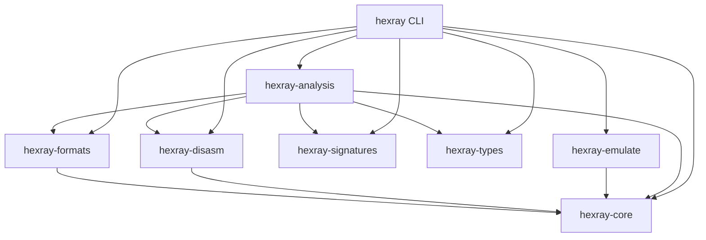
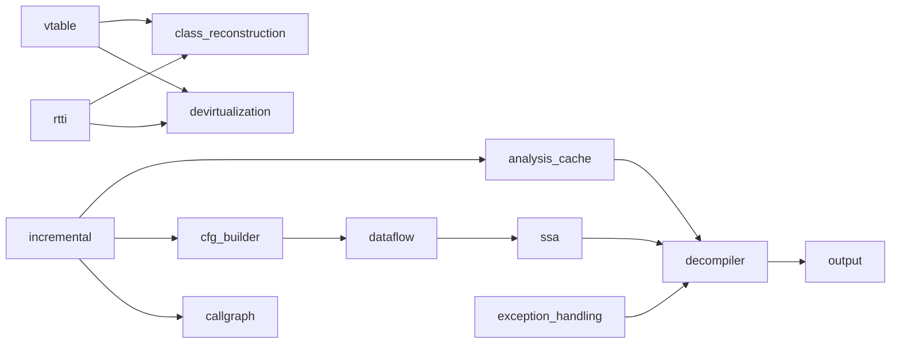

# Module Dependency Diagrams

This page summarizes crate-level and analysis-layer dependencies.

## Crate-level overview

## `hexray-analysis` internals (high-level)

## Notes

- `analysis_cache` and `incremental` are cross-cutting and intentionally reused by multiple workflows.
- `devirtualization`, `class_reconstruction`, and `exception_handling` feed decompiler quality for C++ targets.
- Dependency direction is logical usage, not exhaustive Rust import graph detail.
